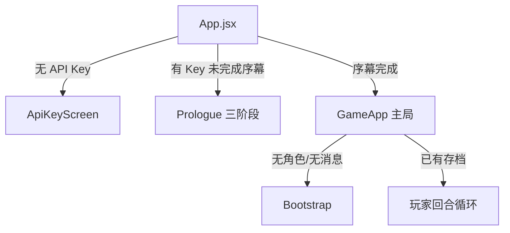
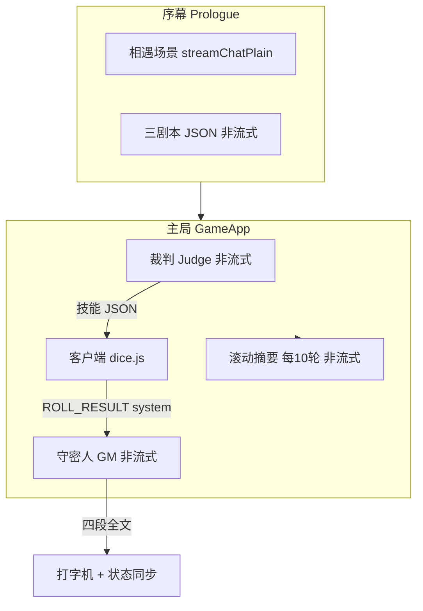
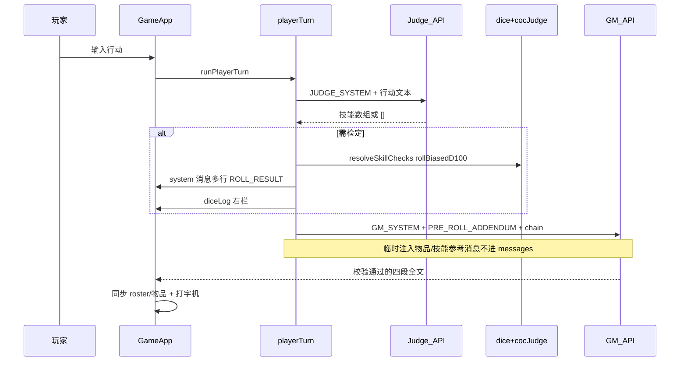

# coc-simulator 完整认知图（供 AI 阅读）

## 一句话定义

> **纯前端克苏鲁的呼唤（CoC）文字跑团客户端**：React 19 + Vite，浏览器直连 DeepSeek `deepseek-v4-flash`（无后端）；**模型只写剧情与裁定叙述，1d100 随机数永远由客户端生成**。

**延伸阅读**：[ARCHITECTURE.md](./ARCHITECTURE.md)（实现细节与章节索引）、[AGENTS.md](./AGENTS.md)（改代码红线摘要）。

---

## 角色分工（最易混淆点）

| 谁 | 真人/AI | 程序字段 | 出现在哪 |
|----|---------|----------|----------|
| 何以惜顾 | **玩家** | `player` | 聊天气泡 `role: 'player'`；左栏 HP/MP/SAN/符纸 |
| 林知渺 | **AI 扮演** | `partner` 仅数值面板 | GM 回复的 `【林知渺】` 段，**不是**第二个玩家账号 |
| 守密人 | **AI** | `gm` | 四段结构化回复 |

**铁律**：`partner` ≠ 玩家；林知渺的对白写在 GM 消息里，不单独发 player 气泡。

---

## 应用阶段（路由骨架）



- 入口：[`src/App.jsx`](./src/App.jsx) — `apiKey` → `Prologue` → `GameApp`
- 存档键：`coc-simulator-state-v1`（[`src/storage.js`](./src/storage.js)）
- API Key 仅存 `localStorage`，不上传自有服务器

---

## 三类 AI 调用（分工明确）



| 角色 | System Prompt 文件 | 输入 | 输出 | 何时调用 |
|------|-------------------|------|------|----------|
| **守密人 GM** | [`src/config/system_prompt.js`](./src/config/system_prompt.js) `GM_SYSTEM_PROMPT` | 全量 `messages` replay + 本轮 chain | 固定四段中文 | Bootstrap、第一幕、每轮玩家行动后 |
| **裁判 Judge** | [`src/config/judge_prompt.js`](./src/config/judge_prompt.js) | 玩家行动文本 | `[{"skill":"…","value":N},…]` 或 `[]` | [`src/playerTurn.js`](./src/playerTurn.js) 每轮开头 |
| **滚动摘要** | [`src/config/summary_prompt.js`](./src/config/summary_prompt.js) | 第 n–m 轮对话 | 压缩摘要消息 | 每 **10** 次成功玩家回合（[`src/GameApp.jsx`](./src/GameApp.jsx) `playerTurnCount % 10`） |

序幕专用 prompt：[`src/config/prologue_prompt.js`](./src/config/prologue_prompt.js)、[`src/config/act_one_prompt.js`](./src/config/act_one_prompt.js)。序幕 AI 文本**默认不进** `messages`；入局后由 `startActOne` 用虚拟 user 生成第一幕。

---

## 守密人（GM）输出协议 — 核心

定义于 `GM_SYSTEM_PROMPT`，由 [`src/validateGmReply.js`](./src/validateGmReply.js) 程序化校验（失败则 [`src/gmTurn.js`](./src/gmTurn.js) **静默重试 1 次**）。

### 每条回复必须且只能有四段（顺序固定）

1. **【场景】** — 环境、剧情、何以惜顾侧叙述（不替玩家做决定/发言）
2. **【林知渺】** — 仅 AI 扮演的林知渺言行
3. **【当前状态】** — 严格格式，含：
   - `何以惜顾 HP/MP/SAN/符纸` + `林知渺 HP/MP/SAN`
   - `何以惜顾物品` / `林知渺物品` / `探索物品`（每次完整列表）
4. **【你可以：】** — 列出何以惜顾可采取的行动（不问「要不要检定」）

### 叙事禁令（与掷骰配合）

- **不知道结果再写结果**：有风险行动只能写到「行动瞬间」，然后 `[ROLL:技能名:技能值]` 并停止（主流程玩家回合已预掷，见下）
- **免掷清单**：纯对话/观察/移动、异感被动、纯剧情描写、林知渺日常情绪 — 其余有风险必掷
- **玩家回合追加** `GM_PRE_ROLL_NARRATIVE_ADDENDUM`：骰点已在 system 里，**禁止再插 `[ROLL]`**，根据 `[ROLL_RESULT:…]` 一次写完四段

### 呈现管线（主路径，非流式）

```
fetchValidatedGmReply (postChatNonStream)
  → validateGmReply 四段+状态块
  → applyRosterFromGmText (parseGmStatus + syncInventory)
  → runTypewriter 写入 gm 气泡
```

实现：[`src/GameApp.jsx`](./src/GameApp.jsx) `presentGm` + [`src/typewriter.js`](./src/typewriter.js)。

---

## 玩家回合完整数据流（主流程）



编排：[`src/playerTurn.js`](./src/playerTurn.js)

**Chain 组成**（当次 API 请求，非全部持久化）：

```
snap（历史 messages）
+ userMsg（本轮玩家）
+ ephemeralItemMessages（当前物品快照，src/itemInject.js）
+ ephemeralSkillMessages（本轮检定技能名，src/playerSkills.js）
+ preSystemMessages（若有掷骰：[ROLL_RESULT:技能:点数:判定]）
```

裁判返回的 `value` 会被 `applyPlayerSkillValues` 用角色卡真实技能覆盖（[`src/config/characters.js`](./src/config/characters.js)）。

---

## 掷骰：两条路径（只记一条主路径）

| 路径 | 状态 | 机制 |
|------|------|------|
| **A. 裁判 + 预掷** | **主流程** | Judge → 客户端 `rollBiasedD100` → `[ROLL_RESULT]` system → GM 写后果 |
| **B. 流式 `[ROLL]` 中断** | **备用** [`src/gmRollLoop.js`](./src/gmRollLoop.js) | SSE 检测到 `[ROLL:…]` 后 abort，掷骰，续写；**当前未被主流程引用** |

### 客户端掷骰规则

- [`src/dice.js`](./src/dice.js) `rollBiasedD100`：**非均匀**，偏向较低点数（96–100 有概率重掷等）
- [`src/cocJudge.js`](./src/cocJudge.js)：大失败(≥96) / 大成功(≤技能/5) / 成功(≤技能) / 失败
- 标记语法：[`src/rollMarker.js`](./src/rollMarker.js) `[ROLL:技能名:1-100]`（技能名不含冒号）

### OpenAI 消息映射（每次请求）

[`src/deepseek.js`](./src/deepseek.js) `chainToOpenAiMessages`：

- 首条固定 `system: GM_SYSTEM_PROMPT`（或 Judge/Summary 各自的 system）
- `gm` → `assistant`
- `player` / `system` → `user`

---

## Bootstrap 与序幕（开局）

### 序幕 [`src/prologue/Prologue.jsx`](./src/prologue/Prologue.jsx)

1. 固定人物文案 + AI 生成「相遇」
2. 非流式生成三个 JSON 剧本 → 玩家单选
3. [`src/prologue/finishPrologue.js`](./src/prologue/finishPrologue.js) 解析角色 JSON → `player`/`partner`，`messages` 仍 `[]`

### Bootstrap [`src/GameApp.jsx`](./src/GameApp.jsx) useEffect ~480ms

| 步骤 | API | User 内容 | 结果 |
|------|-----|-----------|------|
| 1 初始化 | GM + `INIT_USER_MESSAGE` | [`src/config/characters.js`](./src/config/characters.js) 角色卡全文 | JSON → `parseCharacterInitJson` |
| 2 第一幕 | `runActOneStream` → `presentGm` | `buildActOneUserMessage(scenario)` **虚拟 user，不进聊天列表** | 四段 GM + 打字机 |
| 跳过条件 | — | 已有 `messages.length > 0` | 直接解锁输入 |

---

## 持久化与 UI 逻辑视图

```ts
// storage 核心字段（简化）
{
  apiKey, prologueComplete,
  player: { name, hp, mp, san, talisman },
  partner: { name, hp, mp, san },
  playerItems, partnerItems, sceneItems,
  messages: { id, role: 'gm'|'player'|'system', content, ts }[],
  diceLog: 最近 5 条,
  selectedScenario, scenarioTitle, playerTurnCount
}
```

- **左栏**：角色数值（可手改）；GM 回复后从 `【当前状态】` 自动同步，变化字段闪红/绿
- **中栏**：聊天 + GM loading 文案轮换 + 打字机
- **右栏**：最近 5 次掷骰
- **底栏**：`inputLocked` 在 bootstrap/GM 生成期间锁定

---

## 关键源码索引

| 想理解/修改 | 文件 |
|-------------|------|
| 路由与序幕门控 | [`src/App.jsx`](./src/App.jsx) |
| 主局 UI、发送、bootstrap、presentGm | [`src/GameApp.jsx`](./src/GameApp.jsx) |
| 玩家回合编排 | [`src/playerTurn.js`](./src/playerTurn.js) |
| GM 获取+校验 | [`src/gmTurn.js`](./src/gmTurn.js) |
| HTTP / SSE / 消息映射 | [`src/deepseek.js`](./src/deepseek.js) |
| GM 人设与格式 | [`src/config/system_prompt.js`](./src/config/system_prompt.js) |
| 角色卡全文 | [`src/config/characters.js`](./src/config/characters.js) |
| 状态/物品解析 | [`src/parseGmStatus.js`](./src/parseGmStatus.js), [`src/parseGmItems.js`](./src/parseGmItems.js), [`src/syncRosterFromGm.js`](./src/syncRosterFromGm.js) |

**非核心**：`dz/` 为像素精灵实验组件，与 AI 协议无关。

---

## 改代码时勿犯的错（Agent 红线）

1. **不要让模型报骰点** — 随机数只在 `dice.js`
2. **不要把 `partner` 当玩家账号**
3. **改 GM 四段格式** — 必须同步 `system_prompt.js`、`validateGmReply.js`、`parseGmStatus`/`parseGmItems`
4. **虚拟 user**（第一幕、开场）在 API chain 里存在，但通常**不写入** `messages` 列表
5. **主流程已是非流式 GM** — 不要误接 `gmRollLoop`，除非明确要恢复流式 `[ROLL]` 链
