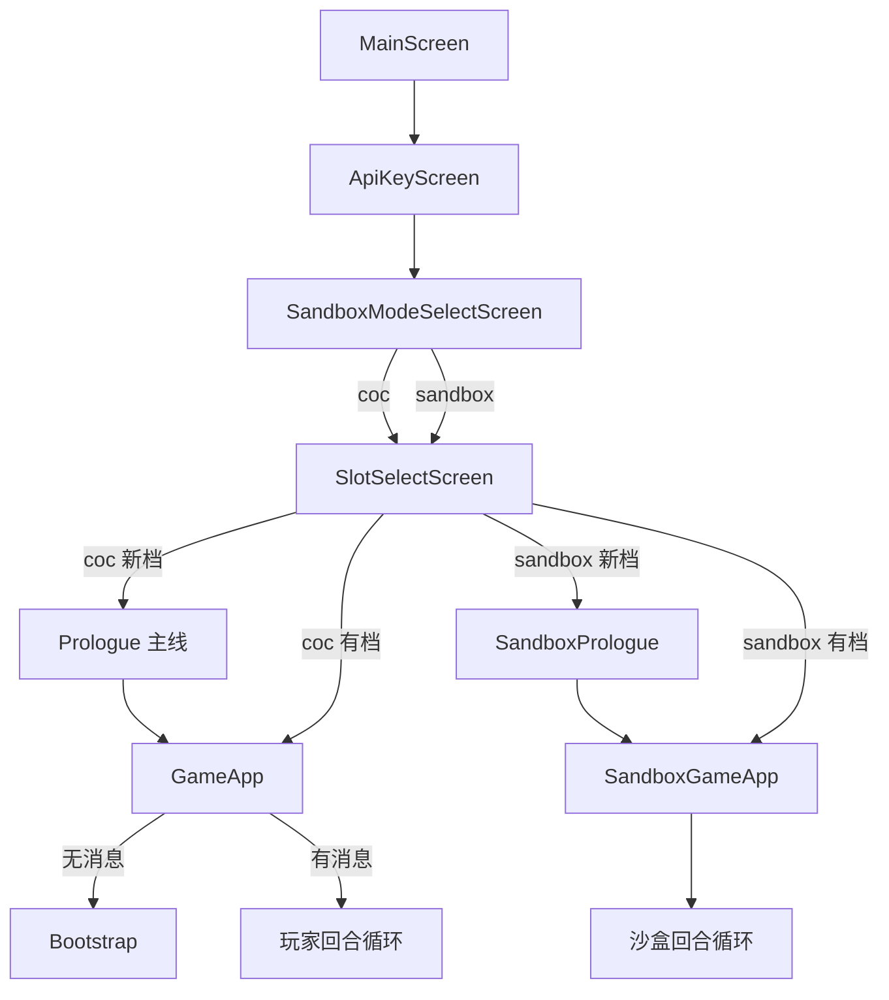
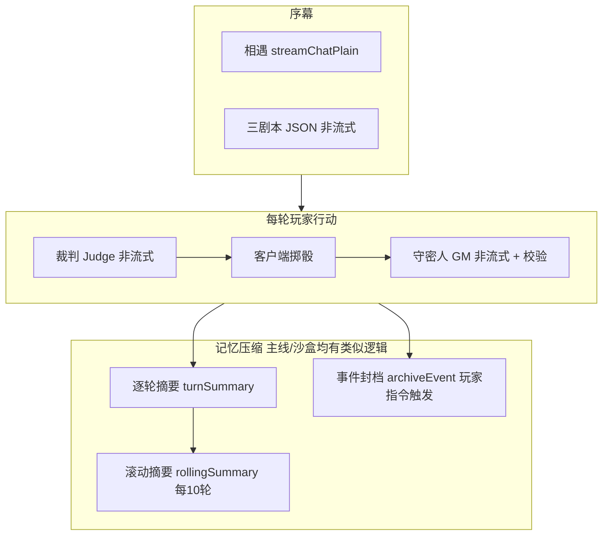
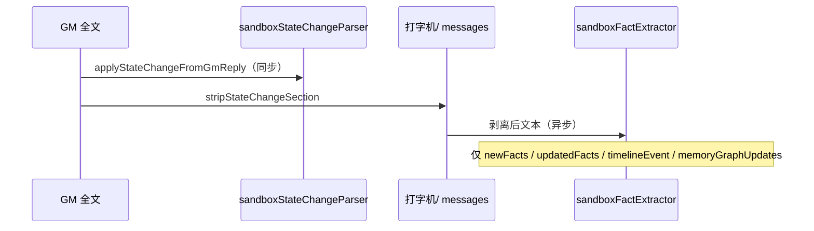
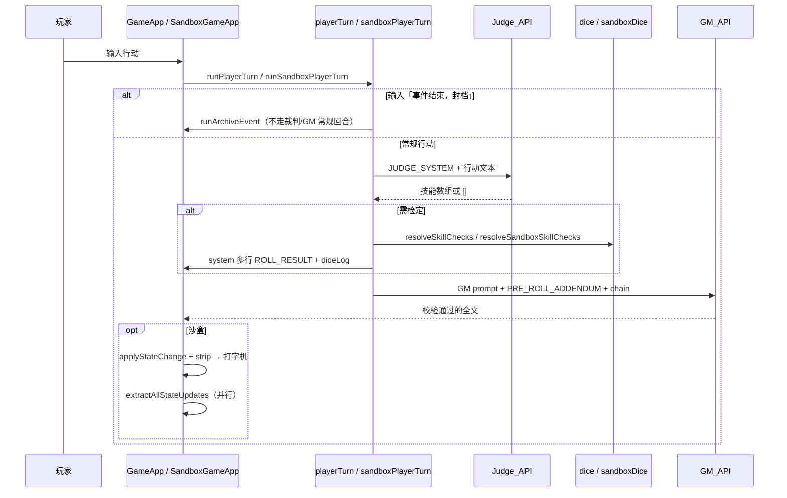

# coc-simulator 完整认知图（供 AI 阅读）

> 新会话零上下文上手本文档即可；实现细节见 [ARCHITECTURE.md](./ARCHITECTURE.md)，改代码红线见 [AGENTS.md](./AGENTS.md)。

## 一句话定义

> **纯前端文字跑团 SPA**（React 19 + Vite 8）：浏览器直连 DeepSeek `deepseek-v4-flash`（无后端）；**模型只写剧情与裁定叙述，1d100 永远由客户端生成**。
>
> 内含两种玩法：**主线 CoC**（固定人设何以惜顾 + 林知渺 + 克苏鲁民俗志）与 **沙盒模式**（玩家自建角色 + 自选世界观，六段 GM 格式含机器可读 `【状态变更】`）。

---

## 双模式对照（先读这张表）

| 维度 | 主线 CoC | 沙盒 Sandbox |
|------|----------|----------------|
| 入口组件 | `GameApp.jsx` | `SandboxGameApp.jsx` |
| 序幕 | `prologue/Prologue.jsx`（三剧本） | `sandbox/prologue/SandboxPrologue.jsx`（建角） |
| 玩家角色 | 固定何以惜顾 | `SandboxCharacter` 自建 |
| 同伴 | 林知渺（`partner` 数值 + GM `【林知渺】` 段） | `companions`（最多 2 名 active）；NPC 在 `【他人行为】` |
| GM 格式 | **四段** | **六段**（展示五段 + `【状态变更】` JSON，入库前剥离） |
| System Prompt | `config/system_prompt.js` `GM_SYSTEM_PROMPT` | `sandbox/config/sandbox_system_prompt.js` `buildSandboxGmPrompt(character, world)` |
| 校验 | `validateGmReply.js` | `sandboxValidateGmReply.js` |
| 玩家回合 | `playerTurn.js` | `sandboxPlayerTurn.js` |
| 掷骰 | `dice.js` + `resolveTurnRolls.js` | `sandboxDice.js`（含连续失败保底） |
| 裁判 | `judge_prompt.js` | `sandbox_judge_prompt.js` |
| 存档 | `storage.js` 槽位 `coc-slot-1/2` | `sandboxStorage.js` 槽位 `sandbox-slot-*` + 侧存储（事实/NPC/世界/任务/时间线/记忆图） |
| 状态写入 | `【当前状态】` 文本解析 | `【状态变更】` **代码解析** + `【当前状态】` 文本同步 UI |
| 撤回 | 无 | 最近一轮 GM 前快照（`saveUndoSnapshot` / `restoreUndoSnapshot`） |
| 世界观 | `world_detail.js` 民国上海民俗 | `sandbox_worlds.js` + `worldbook/` 关键词注入 |

**共用**：`deepseek.js`、`gmTurn.js`（非流式 GM + 重试）、`skillJudge.js`、`typewriter.js`、裁判→预掷→GM 主流程。

---

## 角色分工（主线最易混淆点）

| 谁 | 真人/AI | 程序字段 | 出现在哪 |
|----|---------|----------|----------|
| 何以惜顾 | **玩家** | `player` | 气泡 `role: 'player'`；左栏 HP/MP/SAN/符纸 |
| 林知渺 | **AI 扮演** | `partner` 仅数值面板 | GM 的 `【林知渺】` 段，**不是**第二个玩家账号 |
| 守密人 | **AI** | `gm` | 四段结构化回复 |

**铁律**：`partner` ≠ 玩家；林知渺对白写在 GM 消息里，不单独发 player 气泡。沙盒无 `partner` 字段。

---

## 应用阶段（路由骨架）



- 入口：[`src/App.jsx`](./src/App.jsx) — `screen` 状态机（`main` → `apiKey` → `modeSelect` → `slotSelect` → 序幕/主局）
- 全局偏好键：`coc-simulator-state-v1`（API Key、`selectedMode`、`selectedSlot`）
- 对局数据：按槽位分键写入（见 [持久化](#持久化与-ui)）
- API Key 仅存 `localStorage`，不上传自有服务器

---

## AI 调用一览（分工明确）



| 角色 | Prompt 文件 | 输入 | 输出 | 何时调用 |
|------|-------------|------|------|----------|
| **守密人 GM** | 主线 `system_prompt.js`；沙盒 `buildSandboxGmPrompt(...)` | `messages` replay + 本轮 chain | 四段 / 六段（含 JSON） | Bootstrap、开场、每轮玩家行动后 |
| **沙盒后台提取** | `sandboxFactExtractor.js` | 剥离后的 GM 五段文本 | JSON：事实/时间线/记忆图 | GM 打字机并行，静默失败 |
| **裁判 Judge** | 主线 `judge_prompt.js`；沙盒 `sandbox_judge_prompt.js` | 玩家行动文本 | `[{"skill":"…","value":N},…]` 或 `[]` | `playerTurn.js` / `sandboxPlayerTurn.js` 每轮开头 |
| **逐轮摘要** | `summary_prompt.js`（user 侧短提示） | 单轮对话 exchange | 2~3 句 | 每轮成功结束后后台 `runTurnSummary` |
| **滚动摘要** | `summary_prompt.js` `buildRollingSummarySystemPrompt` | 第 n–m 轮逐轮摘要或原文 | 一条 `isSummary` 消息替换旧段 | `playerTurnCount % 10 === 0`（队列串行） |
| **事件封档** | `archiveEvent.js` 内联 system | 自上次封档以来的对话 | `【事件N总结】`…`【封档】` | 玩家输入 **`事件结束，封档`** |

序幕专用：[`prologue_prompt.js`](./src/config/prologue_prompt.js)、[`act_one_prompt.js`](./src/config/act_one_prompt.js)。序幕 AI 文本**默认不进** `messages`；入局后由 `startActOne` 用**虚拟 user** 生成第一幕。

封档摘要写入 `archivedEvents[]`，后续 GM system 通过 `buildGmSystemPrompt(archivedEvents)` / `buildSandboxGmPrompt(..., archivedEvents)` 注入，**不必在聊天里复述**。

---

## 守密人（GM）输出协议 — 主线四段

定义于 `GM_SYSTEM_PROMPT`（[`src/config/system_prompt.js`](./src/config/system_prompt.js)），由 [`validateGmReply.js`](./src/validateGmReply.js) 校验（失败则 [`gmTurn.js`](./src/gmTurn.js) **静默重试 1 次**）。

### 每条回复必须且只能有四段（顺序固定）

1. **【场景】** — 环境、剧情；不替玩家做决定/发言
2. **【林知渺】** — 仅 AI 扮演的林知渺言行
3. **【当前状态】** — `何以惜顾 HP/MP/SAN/符纸` + `林知渺 HP/MP/SAN` + 三类物品**完整列表**（何以惜顾/林知渺/探索物品）
4. **【你可以：】** — 列出何以惜顾可采取的行动（不问「要不要检定」）

### 叙事与掷骰

- **有风险**：叙述到行动瞬间 → `[ROLL:技能名:技能值]` → 停止（流式备用路径用；**玩家回合主流程已预掷**）
- **免掷**：纯对话/观察/移动、异感被动、纯剧情、林知渺日常情绪等
- **玩家回合追加** `GM_PRE_ROLL_NARRATIVE_ADDENDUM`：骰点已在 system 的 `[ROLL_RESULT:…]` 里 → **禁止再插 `[ROLL]`** → 根据已知结果一次写完四段

### 呈现管线（主路径，非流式）

```
fetchValidatedGmReply (postChatNonStream)
  → validateGmReply
  → syncRosterFromGm / parseGmItems（左栏数值与物品）
  → runTypewriter 写入 gm 气泡
```

实现：[`GameApp.jsx`](./src/GameApp.jsx) `presentGm` + [`typewriter.js`](./src/typewriter.js)。

---

## 守密人（GM）输出协议 — 沙盒六段

定义于 [`buildSandboxGmPrompt`](./src/sandbox/config/sandbox_system_prompt.js)，由 [`sandboxValidateGmReply.js`](./src/sandbox/sandboxValidateGmReply.js) 校验（同样走 `fetchValidatedSandboxGmReply`，失败静默重试 1 次）。

### 每条回复必须且只能有六段（顺序固定）

1. **【场景】** — 环境与氛围；不替玩家发言
2. **【主角行为】** — 本轮玩家行动在叙事中的展开（预掷骰须体现后果）
3. **【他人行为】** — NPC/环境反应；无则写「无」
4. **【当前状态】** — 主角 + 伙伴 HP/MP/物品行（供人读；程序另读第六段）
5. **【你可以：】** — 2~4 个可行动项
6. **【状态变更】** — **严格 JSON**（NPC/任务/地点/环境/背包/同伴/玩家数值等）；无变化字段用 `[]` 或 `null`

**展示与存档**：`SandboxGameApp.presentGm` 在校验通过后先 [`applyStateChangeFromGmReply`](./src/sandbox/sandboxStateChangeParser.js)，再 [`stripStateChangeSection`](./src/sandbox/sandboxStateChangeParser.js) — 打字机与 `messages` **不含**第六段。

**世界观铁律**（prompt 内嵌）：不得引入克苏鲁/SAN/越界元素；技能名为固定八项（见 `SANDBOX_SKILL_NAMES`）。

玩家回合追加 `SANDBOX_PRE_ROLL_ADDENDUM`（须写完**含【状态变更】的完整六段**），逻辑同主线预掷。

每轮 chain 可注入 [`buildSandboxContextMessage`](./src/sandbox/sandboxContextInject.js)（角色快照）；GM system 另注入匹配 NPC、activeFacts、时间线、worldState、questState、记忆子图等（见 `sandboxPlayerTurn.js`）。

### GM 后双轨状态更新



NPC 档案、任务、世界状态、背包、同伴数值等**不再**由 `sandboxFactExtractor` 提取，避免与第六段重复。

---

## 玩家回合完整数据流



编排：[`playerTurn.js`](./src/playerTurn.js) · [`sandboxPlayerTurn.js`](./src/sandbox/sandboxPlayerTurn.js)

**Chain 组成**（当次 API 请求；临时注入项通常**不**写入长期 `messages`）：

```
snap（历史 messages，含 isSummary / 封档后的切片）
+ userMsg（本轮玩家）
+ [沙盒] contextMsg（角色快照）
+ ephemeralItemMessages（物品快照，itemInject.js — 主线）
+ ephemeralSkillMessages（本轮检定技能名，playerSkills.js — 主线）
+ preSystemMessages（若有掷骰：多行 [ROLL_RESULT:技能:点数:判定]）
```

裁判返回的 `value` 会被角色卡覆盖：主线 `applyPlayerSkillValues` + [`characters.js`](./src/config/characters.js)；沙盒 `applySandboxSkillValues` + `character.skills`。

---

## 掷骰：两条路径（只记主路径）

| 路径 | 状态 | 机制 |
|------|------|------|
| **A. 裁判 + 预掷** | **主流程** | Judge → 客户端掷骰 → `[ROLL_RESULT]` system → GM 写后果 |
| **B. 流式 `[ROLL]` 中断** | **备用** [`gmRollLoop.js`](./src/gmRollLoop.js) | SSE 见 `[ROLL:…]` 后 abort、掷骰、续写；**当前未被主流程引用** |

### 客户端掷骰规则

- 主线 [`dice.js`](./src/dice.js) `rollBiasedD100`：**非均匀**，96–100 有概率重掷等，整体偏向较低点数
- 沙盒 [`sandboxDice.js`](./src/sandbox/sandboxDice.js)：同样偏向 + **`consecutiveFails`** 连续失败达阈值后保底成功
- 判定 [`cocJudge.js`](./src/cocJudge.js)：≥96 大失败；≤技能/5 大成功；≤技能 成功；否则失败
- 标记 [`rollMarker.js`](./src/rollMarker.js)：`[ROLL:技能名:1-100]`（技能名不含冒号）

`[ROLL_RESULT:技能名:骰面:判定中文]` 判定词：`大成功 | 成功 | 失败 | 大失败`

### OpenAI 消息映射

[`deepseek.js`](./src/deepseek.js) `chainToOpenAiMessages`：

- 首条固定 `system`（GM / Judge / Summary 各自文案）
- `gm` → `assistant`
- `player` / `system` → `user`

---

## Bootstrap 与序幕

### 主线序幕 [`prologue/Prologue.jsx`](./src/prologue/Prologue.jsx)

1. 固定人物文案 + AI「相遇」（流式）
2. 非流式三剧本 JSON → 玩家单选
3. [`finishPrologue.js`](./src/prologue/finishPrologue.js) → `player`/`partner`，`messages` 仍 `[]`

### 主线 Bootstrap [`GameApp.jsx`](./src/GameApp.jsx) ~480ms

| 步骤 | User 内容 | 结果 |
|------|-----------|------|
| 1 初始化 | `INIT_USER_MESSAGE`（角色卡全文） | JSON → `parseCharacterInitJson` |
| 2 第一幕 | `buildActOneUserMessage(scenario)` **虚拟 user，不进聊天列表** | 四段 GM + 打字机 |
| 跳过 | 已有 `messages.length > 0` | 直接解锁输入 |

### 沙盒序幕 [`sandbox/prologue/SandboxPrologue.jsx`](./src/sandbox/prologue/SandboxPrologue.jsx)

建角（姓名、性别、背景、技能点、世界观）→ 非流式开场 **六段**（`SandboxPrologue` 打字机展示剥离后文本）→ [`finishSandboxPrologue.js`](./src/sandbox/prologue/finishSandboxPrologue.js) 用 `openingRaw` 应用 `【状态变更】` 后写入槽位。

---

## 持久化与 UI

### 主线 `CocGameState`（每槽 `coc-slot-1` / `coc-slot-2`）

```ts
{
  player, partner, messages[], diceLog[],  // diceLog 最多保留 5 条
  prologueComplete, selectedScenario, scenarioTitle,
  playerTurnCount, playerItems[], partnerItems[], sceneItems[],
  turnSummaries: { turn, summary }[],
  archivedEvents: { index, summary, archivedAt, endMessageId? }[],
  eventIndex
}
```

### 沙盒 `SandboxGameState`（`sandbox-slot-*`）

主槽字段 + 侧存储键（`sandboxStorage.js`）：

```ts
// 主槽 assembleSandboxState
{
  character, world, companions[], playerInventory,
  messages[], diceLog[],
  playerTurnCount, turnSummaries[], archivedEvents[], eventIndex,
  consecutiveFails, prologueComplete,
  __version  // 迁移版本，见 sandboxMigration.js
}
// 侧存储（按槽分键）
// npc-archive, fact-database, event-timeline, world-state,
// quest-state, npc-memory-graph, undo-snapshot
```

**加载时迁移**：[`sandboxMigration.js`](./src/sandbox/sandboxMigration.js) 在 `loadSandboxSlot` / `loadNpcArchive` / `loadFactDatabase` / `loadEventTimeline` / `loadWorldState` 后补全缺省字段（`CURRENT_VERSION` 递增时加分支）。

**撤回**：发送前（`playerTurnCount > 0`）`saveUndoSnapshot`；八合一结束后 `canUndo`；`restoreUndoSnapshot` 恢复主槽 + 侧存储并填回输入框（第一轮无撤回按钮）。

### UI 逻辑视图（两模式类似）

- **左栏**：角色数值（可手改）；GM 后从 `【当前状态】` 自动同步，变化字段闪红/绿
- **中栏**：聊天（`gm` / `player` / `system`）；`isSummary`、`isArchive` 样式区分；GM loading + 打字机
- **右栏**：最近 5 次掷骰
- **底栏**：`inputLocked` 在 bootstrap / GM 生成 / 封档期间锁定

---

## 关键源码索引

| 想理解/修改 | 文件 |
|-------------|------|
| 路由、模式、槽位 | [`src/App.jsx`](./src/App.jsx) |
| 主线主局 | [`src/GameApp.jsx`](./src/GameApp.jsx) |
| 沙盒主局 | [`src/sandbox/SandboxGameApp.jsx`](./src/sandbox/SandboxGameApp.jsx) |
| 玩家回合 | [`src/playerTurn.js`](./src/playerTurn.js) · [`src/sandbox/sandboxPlayerTurn.js`](./src/sandbox/sandboxPlayerTurn.js) |
| GM 获取+校验 | [`src/gmTurn.js`](./src/gmTurn.js) |
| HTTP / SSE / 映射 | [`src/deepseek.js`](./src/deepseek.js) |
| 主线 GM 人设 | [`src/config/system_prompt.js`](./src/config/system_prompt.js) |
| 沙盒 GM 人设 | [`src/sandbox/config/sandbox_system_prompt.js`](./src/sandbox/config/sandbox_system_prompt.js) |
| 沙盒【状态变更】解析 | [`sandboxStateChangeParser.js`](./src/sandbox/sandboxStateChangeParser.js), [`extractStateChangeJson`](./src/sandbox/sandboxValidateGmReply.js) |
| 沙盒【当前状态】文本解析 | [`sandboxParseGmStatus.js`](./src/sandbox/sandboxParseGmStatus.js) |
| 沙盒后台提取 | [`sandboxFactExtractor.js`](./src/sandbox/sandboxFactExtractor.js) |
| 沙盒存档迁移 | [`sandboxMigration.js`](./src/sandbox/sandboxMigration.js) |
| 角色卡 | [`src/config/characters.js`](./src/config/characters.js) |
| 主线状态/物品解析 | [`parseGmStatus.js`](./src/parseGmStatus.js), [`parseGmItems.js`](./src/parseGmItems.js), [`syncRosterFromGm.js`](./src/syncRosterFromGm.js) |
| 滚动/逐轮摘要 | [`rollingSummary.js`](./src/rollingSummary.js), [`turnSummary.js`](./src/turnSummary.js) |
| 事件封档 | [`archiveEvent.js`](./src/archiveEvent.js), [`sandboxArchiveEvent.js`](./src/sandbox/sandboxArchiveEvent.js) |
| 存档 | [`storage.js`](./src/storage.js), [`sandboxStorage.js`](./src/sandbox/sandboxStorage.js) |
| 流式 ROLL 备用 | [`gmRollLoop.js`](./src/gmRollLoop.js)（主流程不引用） |

**非核心**：`dz/` 像素精灵实验，与 AI 协议无关。`scripts/fix-sandbox-game-app.mjs` 为一次性修复脚本，非运行时逻辑。

---

## 改代码时勿犯的错（Agent 红线）

1. **不要让模型报骰点** — 随机数只在 `dice.js` / `sandboxDice.js`
2. **不要把 `partner` 当玩家账号**（仅主线）
3. **改 GM 格式** — 主线同步 `system_prompt.js` + `validateGmReply.js` + 解析器；沙盒同步 `sandbox_system_prompt.js` + `sandboxValidateGmReply.js` + `sandboxStateChangeParser.js` + `sandboxParseGmStatus.js`
4. **改沙盒侧存储字段** — 同步 `sandboxMigration.js`（`CURRENT_VERSION++`）与 `sandboxStorage` normalize
5. **虚拟 user**（第一幕、开场）在 API chain 里存在，通常**不写入** `messages` 列表
6. **主流程已是非流式 GM** — 不要误接 `gmRollLoop`，除非明确恢复流式 `[ROLL]` 链
7. **沙盒勿引入 CoC 机制** — 世界观边界写死在 `buildSandboxGmPrompt`
8. **【状态变更】勿进聊天历史** — 落盘与 `extractAllStateUpdates` 使用剥离后文本
9. **封档/摘要消息** — `isSummary` / `isArchive` 参与切片与滚动摘要范围，改动消息结构时需检查 `getTurnMessageRange`、`getArchiveMessageSlice`

---

## 一句话总结

> 固定 Prompt + 角色卡/世界观驱动 DeepSeek 扮演守密人；**裁判预掷骰 → 非流式 GM → 格式校验 → 打字机** 实现「模型写剧情、程序写随机数」；主线四段含林知渺，沙盒六段含 JSON 状态段由程序落库；沙盒另靠事实库/时间线/记忆图后台提取与可选撤回；逐轮摘要 + 每 10 轮滚动摘要 + 可选事件封档控制长对话上下文。
