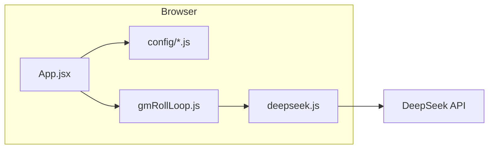
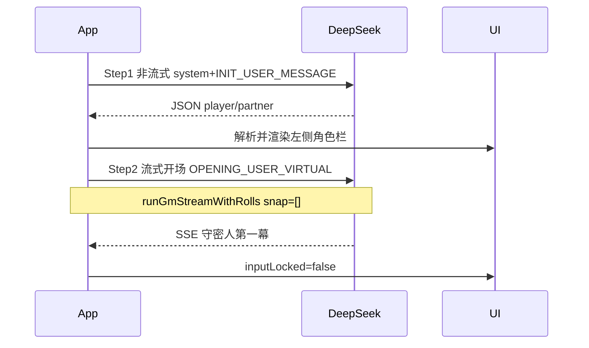
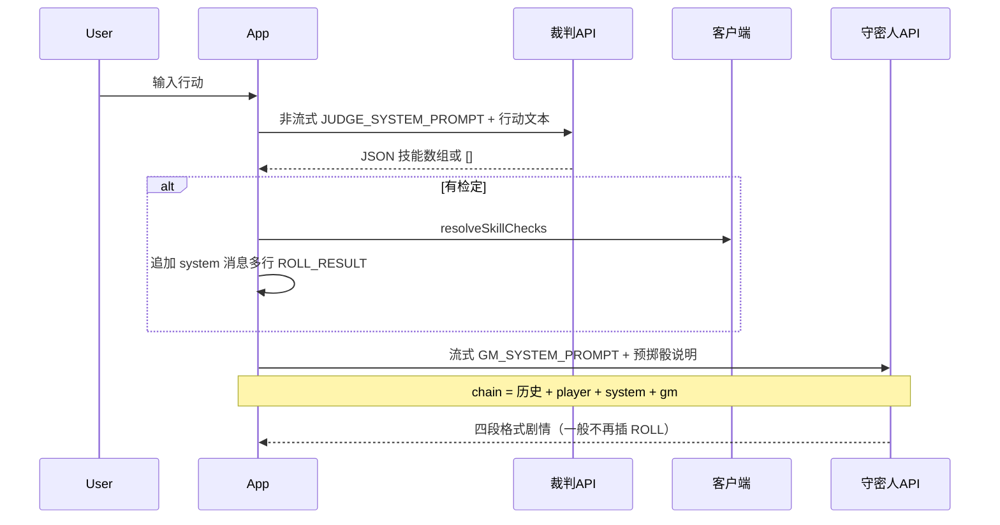
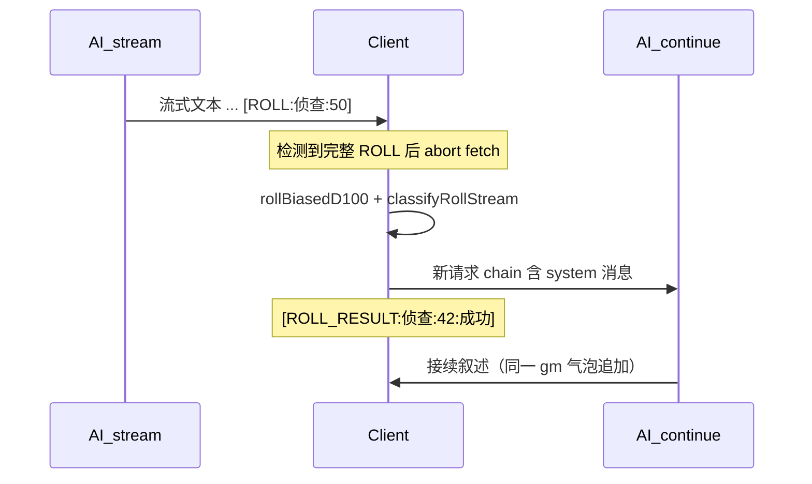

# coc-simulator 项目架构说明（供 AI / 开发者阅读）

## 1. 这是什么

**秘仪残卷 · CoC 模拟台** 是一个纯前端的 **克苏鲁的呼唤 (Call of Cthulhu)** 文字跑团客户端：

- 技术栈：**React 19 + Vite 8**，无后端；浏览器直接调用 **DeepSeek Chat Completions API**（`deepseek-v4-flash`）。
- 用户唯一可配置项：**API Key**（存 `localStorage`）。
- 守密人规则、角色全文、输出格式、掷骰协议均 **硬编码** 在 `src/config/`。
- **角色分工（当前设定）**：
  - **玩家（真人）**：何以惜顾 — 民俗学家，程序内字段名为 `player`，聊天气泡 `role: 'player'`。
  - **AI 扮演**：守密人叙述 + **林知渺**（摄影师同伴）— 林知渺的数值在 `partner`，她的言行写在 GM 回复的 `【林知渺】` 栏。



---

## 2. 目录与职责

| 文件 | 职责 |
|------|------|
| `src/App.jsx` | UI、状态、启动引导、玩家发送、存档 |
| `src/config/system_prompt.js` | `GM_SYSTEM_PROMPT`、开场虚拟 user 消息 |
| `src/config/characters.js` | 完整角色卡文本 + `INIT_USER_MESSAGE` |
| `src/deepseek.js` | HTTP、SSE 流解析、`chainToOpenAiMessages`、流式直到 `[ROLL]` |
| `src/gmRollLoop.js` | 一轮 GM 回复内的「流式 → 掷骰 → 注入结果 → 再流式」循环 |
| `src/rollMarker.js` | 检测 `[ROLL:技能名:数字]` |
| `src/dice.js` | 客户端 `1d100`（带偏向处理） |
| `src/cocJudge.js` | 根据技能值判定大成功/成功/失败/大失败 |
| `src/characterInit.js` | 解析启动 JSON → `player` / `partner` |
| `src/config/judge_prompt.js` | 裁判 API 的 `JUDGE_SYSTEM_PROMPT` |
| `src/skillJudge.js` | 解析裁判返回的技能 JSON 数组 |
| `src/resolveTurnRolls.js` | 客户端批量掷骰、拼 `[ROLL_RESULT:…]` |
| `src/playerTurn.js` | 玩家回合：裁判 → 投骰 → 流式叙述 |
| `src/parseGmStatus.js` | 从 GM 回复解析 `【当前状态】` 数值 |
| `src/syncRosterFromGm.js` | 合并解析结果到 player/partner，计算闪烁方向 |
| `src/storage.js` | `localStorage` 持久化 |

---

## 3. 持久化数据模型

键名：`coc-simulator-state-v1`（`src/storage.js`）

```ts
{
  apiKey: string,
  player: { name, hp, mp, san, talisman } | null,  // 何以惜顾，含符纸
  partner: { name, hp, mp, san } | null,           // 林知渺
  messages: { id, role: 'gm'|'player'|'system', content, ts }[],
  diceLog: { id, skillName, value, dice, outcome, judgeText, ts }[]  // 最多保留 5 条
}
```

**内部 role → OpenAI role**（`src/deepseek.js` → `chainToOpenAiMessages`）：

- `gm` → `assistant`
- `player` / `system` → `user`
- 每条请求首条固定 `system: GM_SYSTEM_PROMPT`

---

## 4. 开场序幕（Prologue）

在 API Key 填写后、主界面之前，全屏序幕 [`src/prologue/Prologue.jsx`](src/prologue/Prologue.jsx) 分三阶段：

1. **人物叙述**：惜顾 / 林知渺固定文案（打字机淡入，段间 1.5s）→ 相遇场景（`streamChatPlain` + `PROLOGUE_MEETING_PROMPT`）→「继续」
2. **剧本选择**：非流式生成三个 JSON 剧本（`parseScenarios.js`）→ 卡片单选 →「开始调查」
3. **入局**：`finishPrologue.js` 仅做角色 JSON 初始化，把选中剧本存入 `selectedScenario`，`messages` 保持 `[]`；序幕中的 AI 文本（相遇、三剧本 JSON）**不进入** `messages`。进入 [`GameApp.jsx`](src/GameApp.jsx) 后由 `startActOne.js` 用虚拟 user 提示 + `runGmStreamWithRolls` 生成符合四段格式的第一幕 GM 回复。

未填 API Key 时仅显示 [`ApiKeyScreen.jsx`](src/prologue/ApiKeyScreen.jsx)。旧存档若已有对话记录，视为序幕已完成。

## 5. 游戏启动流程（Bootstrap）

主界面 [`GameApp.jsx`](src/GameApp.jsx) 加载后，若 **已有** `player && partner && messages.length > 0`，直接解锁输入，不重复初始化。

否则在填写 API Key 后约 **480ms** 执行（`src/App.jsx` bootstrap `useEffect`）：



| 步骤 | API | system | user 内容 | UI |
|------|-----|--------|-----------|-----|
| 1 初始化 | `postChatNonStream` | `GM_SYSTEM_PROMPT` | `INIT_USER_MESSAGE` = 角色卡全文 + 要求只返回 JSON | 解析 HP/MP/SAN/符纸 |
| 2 第一幕 | `runActOneStream` | `GM_SYSTEM_PROMPT` | `buildActOneUserMessage(scenario)`（虚拟 user，不进聊天列表） | 流式 GM 四段格式；完成后清除 `selectedScenario` |
| 3 | — | — | — | 解锁底部输入框 |

`INIT_USER_MESSAGE` 要求模型返回：

```json
{"player":{"name":"","hp":0,"mp":0,"san":0,"talisman":0},"partner":{"name":"","hp":0,"mp":0,"san":0}}
```

解析逻辑见 `src/characterInit.js` → `parseCharacterInitJson`（支持 markdown 代码块包裹的 JSON）。

---

## 5. AI 输出逻辑（守密人协议）

### 5.1 System Prompt 约束

`src/config/system_prompt.js` 中的 `GM_SYSTEM_PROMPT` 规定每条 GM 回复 **必须且只能** 含四段，顺序固定：

1. **【场景】** — 环境与剧情
2. **【林知渺】** — 仅 AI 扮演的林知渺言行（不写玩家操作何以惜顾）
3. **【当前状态】** — `何以惜顾 HP/MP/SAN/符纸` 与 `林知渺 HP/MP/SAN`（与左侧角色卡一致）
4. **【你可以：】** — 列出 **何以惜顾** 可采取的行动（不问「要不要检定」）

规则摘要：CoC 百分骰；**不要替何以惜顾做决定**；需要检定时在正文中插入 `[ROLL:技能名:技能值]` 后 **立即停止生成**。

`GM_SYSTEM_PROMPT` 另含三层 `[ROLL]` 加固策略：（1）**核心禁令**—只写到行动瞬间、禁止先写结果；（2）**免掷清单**—纯对话/观察/移动、异感被动、剧情描写、林知渺日常反应除外，其余有风险行动必掷；（3）**每条回复自检**—有风险却未插 `[ROLL]` 则视为无效输出。

### 5.2 玩家回合（主流程：先裁判 → 先投骰 → 再写剧情）

由 [`playerTurn.js`](src/playerTurn.js) 编排，三步：



1. **裁判**（`postChatNonStream` + `JUDGE_SYSTEM_PROMPT`）：返回 `[{"skill":"…","value":N},…]` 或 `[]`。
2. **投骰**（`resolveTurnRolls.js`）：非空则客户端 `rollBiasedD100` + 判定，写入右侧骰子记录，并追加一条 `system` 消息（多行 `[ROLL_RESULT:技能:点数:判定]`）。
3. **叙述**（`runGmStreamWithRolls` + `GM_PRE_ROLL_NARRATIVE_ADDENDUM`）：根据已知结果写剧情；**不应再插 `[ROLL]`**；若模型仍插入 `[ROLL]`，旧流式中断机制作备用。

开场白仍仅用 `GM_SYSTEM_PROMPT` + `runGmStreamWithRolls`（无裁判步骤）。

对话历史 = `messages` 全量 replay（含预掷骰的 `system` 消息）。

---

## 6. 掷骰逻辑（客户端掷骰；玩家回合以裁判+预掷为主）

随机数 **不由模型生成**。玩家回合由裁判 API 决定检什么，再由客户端掷骰；守密人只根据已给出的 `[ROLL_RESULT:…]` 写后果。流式 `[ROLL]` 中断为 **备用**（开场或模型违规时仍可用）。



### 6.1 AI 侧：发出检定请求

格式（正则 `src/rollMarker.js`）：

```
[ROLL:技能名:技能值]
```

- 技能名：**不能含冒号**
- 技能值：1–100 整数

`src/deepseek.js` → `streamAssistantUntilRollOrEnd` 在 SSE 累积 buffer 上 **每收到 delta 就扫描**；一旦发现完整 `[ROLL:…]`：

1. 截断 buffer 到标记末尾（丢弃标记后已生成的多余 token）
2. `AbortController` 中止当前 HTTP 流
3. 返回 `{ text, roll: { skillName, skillValue } }`

### 6.2 客户端：真实掷骰与判定

`src/gmRollLoop.js` 每轮：

1. `rollByLabel('1d100')` → `src/dice.js` → `rollBiasedD100`（**非均匀**：96–100 有 50% 重掷到 1–95，再减 8–12 偏移，偏向「较低点数、更易成功」）
2. `classifyRollStream(roll, skillValue)` → `src/cocJudge.js`：
   - roll ≥ 96 → **大失败**
   - roll ≤ skill/5 → **大成功**
   - roll ≤ skill → **成功**
   - 否则 → **失败**
3. 若 `[ROLL]` 未解析到技能值，用常量 `FALLBACK_ROLL_SKILL = 50`（`src/App.jsx`）

### 6.3 回灌给 AI

追加一条 **`role: 'system'`** 消息（UI 显示为 `[系统]`），内容为：

```
[ROLL_RESULT:技能名:骰面:判定中文]
请立刻接续输出，勿重复已生成的上文。
```

判定中文：`大成功 | 成功 | 失败 | 大失败`

同时写入 `diceLog`（右侧最近 5 条）。

### 6.4 续写循环

`chainForOpenAi` 重建为：

```
snap + userMsg + gm(已累计正文) + 本轮所有 system 掷骰消息
```

再次 `streamAssistantUntilRollOrEnd`，最多 **12 轮** `[ROLL]`/续写（防止死循环）。

同一物理 `gm` 气泡 ID 不变，内容 `prefixGm + 新流` 持续追加。

---

## 7. UI 布局（逻辑视图）

- **左栏**：API Key；何以惜顾（player，可编辑 HP/MP/SAN/符纸）；林知渺（partner，可编辑 HP/MP/SAN）。GM 每轮输出结束后，`parseGmStatus.js` 从 `【当前状态】` 行解析数值并自动同步（失败则保持原值）；有变化的字段输入框会闪红（降低）或淡绿（升高）约 1 秒。
- **中栏**：聊天（gm / player / system）；流式时 `bubble-streaming`
- **右栏**：最近 5 次掷骰记录
- **底栏**：玩家输入（`inputLocked` 在开场完成前禁用）

**重置故事**：清空 messages、diceLog、角色数值；保留 apiKey；重新走 Bootstrap。

---

## 8. 修改时的注意点

| 想改什么 | 改哪里 |
|----------|--------|
| GM 人设 / 输出格式 / ROLL 协议 | `src/config/system_prompt.js` |
| 角色设定 / 初始化 JSON 说明 | `src/config/characters.js` |
| 掷骰公平性 / 偏移 | `src/dice.js` |
| 成功线规则 | `src/cocJudge.js` |
| ROLL 标记语法 | `src/rollMarker.js` + `system_prompt.js` 同步 |
| 流式中断行为 | `src/deepseek.js` + `src/gmRollLoop.js` |
| 启动步骤 | `src/App.jsx` bootstrap useEffect |

**常见误区**：

- **AI 不会自己掷 1d100**；必须在叙述里输出 `[ROLL:…]`，由客户端掷骰并注入 `[ROLL_RESULT:…]`。
- `partner` 是林知渺的 **数值面板**，不是第二个玩家账号；林知渺台词在 **GM 消息的【林知渺】段**。
- 开场 user 消息在 API 链里存在，但 **默认不进入 `messages` 数组**（仅 `OPENING_USER_VIRTUAL`）。

---

## 9. 一句话总结

> 这是一个用 **固定 System Prompt + 超长角色卡** 驱动 DeepSeek 扮演 CoC 守密人的 SPA；通过 **`[ROLL]` 流式断点 + 客户端 1d100 + `[ROLL_RESULT]` 回灌** 实现「模型写剧情、程序写随机数」的跑团循环，玩家扮演何以惜顾，模型在结构化回复中同时写场景与林知渺。
