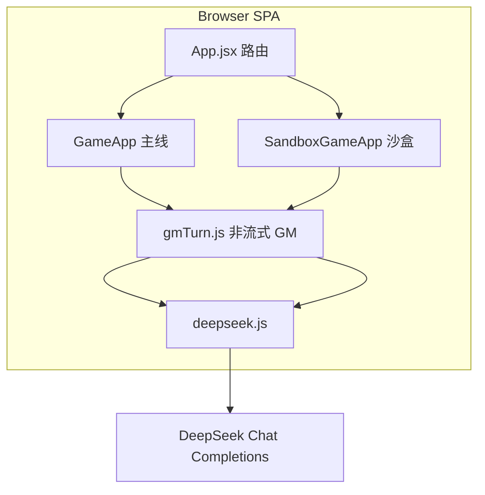
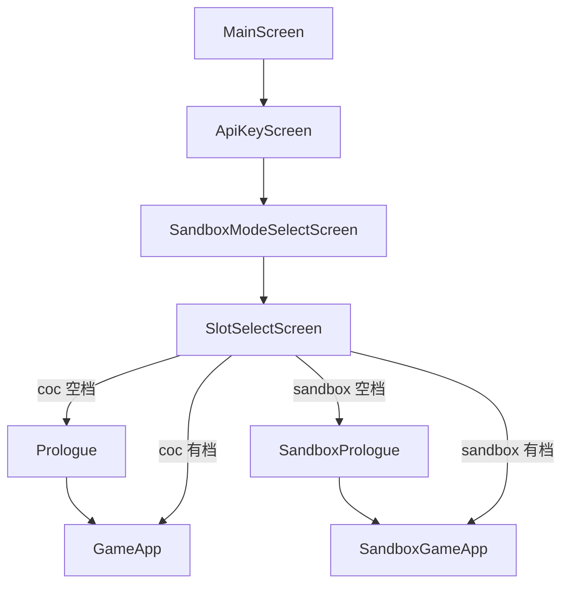
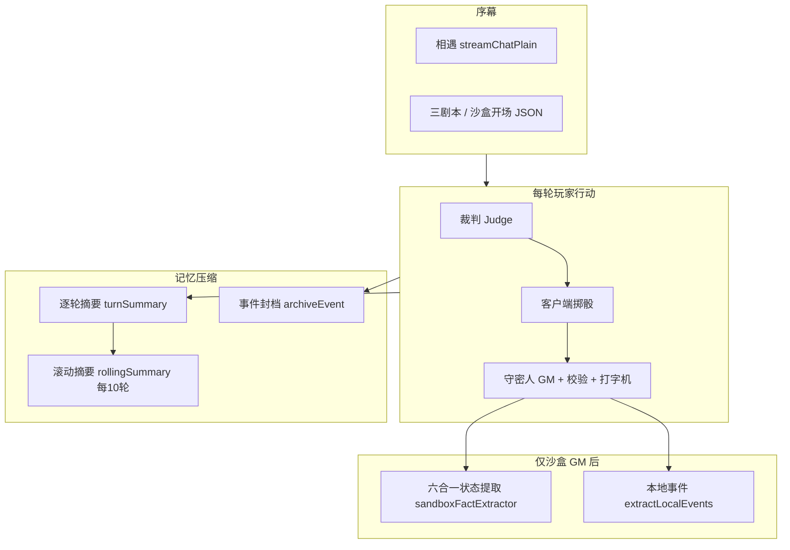
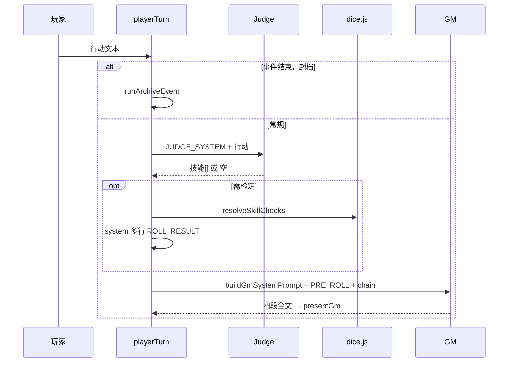

# coc-simulator 项目架构说明（供 AI / 开发者阅读）

> **新会话首选**：[`AI_ONBOARDING.md`](./AI_ONBOARDING.md) — 完整认知图（双模式、全部 AI 调用、玩家回合 chain、GM 协议、Agent 红线）。  
> **本文档** — 在 onboarding 基础上展开：整体框架、AI 输出逻辑、数据流、持久化、沙盒扩展、改代码索引。  
> **改代码约束**：[`AGENTS.md`](./AGENTS.md)

---

## AI 速读（60 秒）

**秘仪残卷 · CoC 模拟台** — 纯前端文字跑团 SPA（React 19 + Vite 8）。浏览器直连 **DeepSeek** `deepseek-v4-flash`，API Key 存 `localStorage`，**无自有后端**。

| 维度 | 主线 CoC | 沙盒 Sandbox |
|------|----------|----------------|
| 主局 | `GameApp.jsx` | `SandboxGameApp.jsx` |
| 玩家 | 固定 **何以惜顾**（`player`） | 自建 `SandboxCharacter` |
| 同伴 | **林知渺**：`partner` 仅数值；台词在 GM `【林知渺】` | 可选 `companions`；NPC 在 `【他人行为】` |
| GM 格式 | **四段** | **五段** |
| GM Prompt | `config/system_prompt.js` | `sandbox/config/sandbox_system_prompt.js` `buildSandboxGmPrompt(...)` |

**铁律：模型从不掷 1d100。** 随机数由 `dice.js` / `sandboxDice.js` 生成，以 `[ROLL_RESULT:技能:骰面:判定]` 注入 API chain。

**每轮玩家行动（主路径）**：裁判 Judge（非流式）→ 客户端预掷骰 → 守密人 GM（非流式 + 格式校验 + 打字机）→ 后台逐轮摘要；沙盒另加 **GM 后状态提取**。

**应用路由**：`App.jsx` `screen` 状态机 — `main` → `apiKey` → `modeSelect` → `slotSelect` → 序幕 → 主局。

**GM 呈现管线**：`fetchValidatedGmReply`（`gmTurn.js`）→ `validateGmReply` / `sandboxValidateGmReply`（失败静默重试 1 次）→ 解析状态/物品 → `typewriter.js` 写入 `gm` 气泡。

**勿误用**：`gmRollLoop.js` 流式 `[ROLL]` 链为备用，**主流程不引用**。

---

## 1. 这是什么

一个用 **固定 System Prompt + 角色卡/世界观** 驱动大模型扮演守密人的跑团客户端，实现 **「模型写剧情、程序写随机数」**：

- **主线**：克苏鲁的呼唤（CoC）— 民国上海民俗志、固定双人组（玩家何以惜顾 + AI 林知渺）。
- **沙盒**：玩家自建角色、自选世界观（奇幻/古代东方等），**禁止**在沙盒叙事中引入 CoC 专有机制（SAN、克苏鲁等）。

技术栈：**React 19 + Vite 8**；HTTP/SSE 封装在 `deepseek.js`；规则与角色全文硬编码在 `src/config/` 与 `src/sandbox/config/`。



---

## 2. 整体框架与路由

### 2.1 屏幕状态机

入口 [`src/App.jsx`](./src/App.jsx)，`screen` 类型：

`main` → `apiKey` → `modeSelect` → `slotSelect` →（主线 `prologue` → `game` | 沙盒 `sandboxPrologue` → `sandboxGame`）



- 填好 API Key 后自动进入模式选择。
- **槽位**：主线 `coc-slot-1/2`，沙盒 `sandbox-slot-*`（见 `storage.js` / `sandboxStorage.js`）。
- 全局偏好键 `coc-simulator-state-v1`：仅存 `apiKey`、`selectedMode`、`selectedSlot`；对局数据按槽位分键。

### 2.2 主局生命周期

| 阶段 | 主线 | 沙盒 |
|------|------|------|
| 序幕 | 人物文案 + AI 相遇 + 三剧本 JSON 单选 | 建角（名/背景/技能/世界观） |
| 入局 | `finishPrologue` → `messages=[]`；`GameApp` bootstrap | `finishSandboxPrologue` → 开场五段 |
| 循环 | 玩家输入 → `runPlayerTurn` | 玩家输入 → `runSandboxPlayerTurn` |
| 长对话 | 逐轮摘要 + 每 10 轮滚动摘要 + 可选封档 | 同构 + 事实库/NPC 档案 |

序幕中的 AI 文本（相遇、三剧本 JSON 等）**默认不进入** `messages`；第一幕/开场使用 **虚拟 user**（API chain 有、聊天列表无）。

---

## 3. 角色分工（主线最易混淆）

| 谁 | 真人/AI | 字段 | 出现在哪 |
|----|---------|------|----------|
| 何以惜顾 | **玩家** | `player` | `role: 'player'`；左栏 HP/MP/SAN/符纸 |
| 林知渺 | **AI 扮演** | `partner` 仅面板 | GM `【林知渺】`，**不是**第二个玩家账号 |
| 守密人 | **AI** | `gm` | 四段/五段结构化回复 |

沙盒无 `partner`；玩家角色名来自 `character.name`，行动写在 `【主角行为】`。

---

## 4. AI 子系统总览

项目中 **所有** 对大模型的调用均可归入下表；**掷骰结果永远不由模型编造**。



| 角色 | Prompt 位置 | 输入 | 输出 | 调用点 |
|------|-------------|------|------|--------|
| **守密人 GM** | 主线 `GM_SYSTEM_PROMPT` + `buildGmSystemPrompt(archivedEvents)`；沙盒 `buildSandboxGmPrompt(...)` | 当轮 `chain` + 历史 `messages` replay | 四段/五段中文 | Bootstrap、每轮 `presentGm` |
| **裁判 Judge** | `judge_prompt.js` / `sandbox_judge_prompt.js` | 玩家行动文本 | `[{"skill":"…","value":N},…]` 或 `[]` | `playerTurn` / `sandboxPlayerTurn` 开头 |
| **逐轮摘要** | `summary_prompt.js` | 单轮 exchange | 2~3 句 | 每轮成功后 `runTurnSummary`（后台） |
| **滚动摘要** | `buildRollingSummarySystemPrompt` | 第 n–m 轮摘要或原文 | 一条 `isSummary` 消息 | `playerTurnCount % 10 === 0` |
| **事件封档** | `archiveEvent.js` 内联 | 自上次封档起对话 | `【事件N总结】`…`【封档】` | 玩家输入 **`事件结束，封档`** |
| **沙盒状态提取** | `sandboxFactExtractor.js` 内 `buildAllStateExtractPrompt` | 本轮 GM 全文 | JSON：事实/NPC/世界/任务/背包等 | GM 完成后 `extractAllStateUpdates`（静默失败） |
| **沙盒地图事件** | `sandboxEventExtractor.js` | GM 回复 + 坐标 | 时间线条目 | `extractLocalEvents`（静默失败） |

### 4.1 OpenAI 消息映射

[`deepseek.js`](./src/deepseek.js) → `chainToOpenAiMessages(systemText, chain)`：

- 请求首条固定 `role: system`（各 API 自己的 system 文案）
- 聊天 `gm` → `assistant`
- `player` / `system` → `user`
- 特殊消息：`isSummary`（滚动压缩）、`isArchive`（封档）— 参与切片与摘要范围，改结构时需查 `getTurnMessageRange` 等

### 4.2 共用 GM 获取层

[`gmTurn.js`](./src/gmTurn.js) `fetchValidatedGmReply`：

1. `postChatNonStream` 拉取全文  
2. `validateGmReply` / `sandboxValidateGmReply`  
3. 失败 → **静默再请求 1 次**  
4. 仍失败 → `{ ok: false }`，UI 显示格式警告  

[`GameApp.jsx`](./src/GameApp.jsx) / [`SandboxGameApp.jsx`](./src/sandbox/SandboxGameApp.jsx) 的 `presentGm` 在校验通过后：解析 roster/物品（主线）或沙盒状态 → 打字机 → 落盘。

---

## 5. AI 输出逻辑 — 守密人（GM）协议

### 5.1 主线：四段（固定顺序）

定义：[`src/config/system_prompt.js`](./src/config/system_prompt.js) `GM_SYSTEM_PROMPT`  
校验：[`validateGmReply.js`](./src/validateGmReply.js)

| 段 | 内容 |
|----|------|
| **【场景】** | 环境、剧情；**不替玩家做决定或发言** |
| **【林知渺】** | 仅 AI 扮演的林知渺言行 |
| **【当前状态】** | 何以惜顾 HP/MP/SAN/符纸 + 林知渺 HP/MP/SAN + 三类物品完整列表（何以惜顾/林知渺/探索物品） |
| **【你可以：】** | 2~4 个何以惜顾可采取的行动（不问「要不要检定」） |

**叙事与 `[ROLL]`**（流式备用路径仍遵守 prompt，但玩家回合主流程已预掷）：

- 有风险行动：叙述到行动瞬间 → `[ROLL:技能名:技能值]` → 停止生成  
- 免掷：纯对话/观察/移动、异感被动、纯剧情、林知渺日常情绪等  
- **玩家回合**追加 `GM_PRE_ROLL_NARRATIVE_ADDENDUM`：骰点已在 `system` 的 `[ROLL_RESULT:…]` 中 → **禁止再插 `[ROLL]`** → 根据已知结果一次写完四段  

解析：[`parseGmStatus.js`](./src/parseGmStatus.js)、[`parseGmItems.js`](./src/parseGmItems.js)、[`syncRosterFromGm.js`](./src/syncRosterFromGm.js) — GM 呈现后同步左栏，变化字段闪红/绿约 1s。

### 5.2 沙盒：五段（固定顺序）

定义：[`buildSandboxGmPrompt`](./src/sandbox/config/sandbox_system_prompt.js)（注入：封档摘要、相关 NPC、同伴、activeFacts、recentEvents、worldState、questState、记忆图、地图坐标等）  
校验：[`sandboxValidateGmReply.js`](./src/sandbox/sandboxValidateGmReply.js)

| 段 | 内容 |
|----|------|
| **【场景】** | 环境与氛围 |
| **【主角行为】** | 本轮玩家行动在叙事中的展开（预掷须体现后果） |
| **【他人行为】** | NPC/环境反应；无则写「无」 |
| **【当前状态】** | `{角色名} HP x/y MP a/b` + `物品：…` |
| **【你可以：】** | 2~4 个可行动项 |

**世界观铁律**（prompt 内嵌）：不得引入克苏鲁/SAN 等越界元素；技能名为沙盒固定八项（战斗、交涉、感知等，见 `SANDBOX_SKILL_NAMES`）。  
玩家回合追加 `SANDBOX_PRE_ROLL_ADDENDUM`，逻辑同主线预掷。

### 5.3 GM 呈现管线（主路径）

```
用户发送
  → presentGm 设置 gmUiPhase='loading'
  → fetchValidatedGmReply (非流式)
  → 校验通过 → applyRosterFromGmText / 沙盒状态解析
  → gmUiPhase='typing' → runTypewriter 逐字更新 gm 气泡
  → gmUiPhase=null → persist 槽位
```

沙盒在 `onGmComplete(gmReply)` 中 **异步** 触发 `extractAllStateUpdates` + `extractLocalEvents`，不阻塞打字机；重新生成时可 `rollbackBeforeExtract`。

---

## 6. 玩家回合完整数据流

### 6.1 主线 [`playerTurn.js`](./src/playerTurn.js)



**当轮 API chain**（`ephemeral*` 通常 **不** 长期留在 `messages`，以代码为准）：

```
snap（历史 messages，含 isSummary / 封档切片）
+ userMsg（本轮玩家）
+ ephemeralItemMessages（物品快照，itemInject.js）
+ ephemeralSkillMessages（本轮检定技能名，playerSkills.js）
+ preSystemMessages（若有掷骰：[ROLL_RESULT:…] 多行）
```

裁判返回的 `value` 由角色卡覆盖：`applyPlayerSkillValues` + [`characters.js`](./src/config/characters.js)。

### 6.2 沙盒 [`sandboxPlayerTurn.js`](./src/sandbox/sandboxPlayerTurn.js)

与主线相同：**Judge → 预掷 → GM**，额外差异：

- Judge user 含玩家名、同行伙伴列表  
- `buildSandboxContextMessage` 角色快照（`contextMsg`）  
- `buildSandboxGmApiChain` 组装 chain  
- GM system 注入 NPC 匹配、事实库、世界状态、任务、记忆图、地图坐标  
- 支持伙伴检定：`resolveSandboxCheckValues`  
- `sandboxDice.js`：`consecutiveFails` 连续失败保底  
- GM 完成后后台 `extractAllStateUpdates`（事实/NPC/世界/任务/背包六合一 JSON 提取）

封档指令：沙盒 `SANDBOX_ARCHIVE_CMD`（与主线 `事件结束，封档` 同类逻辑，见 `sandboxArchiveEvent.js`）。

---

## 7. 掷骰逻辑

| 路径 | 状态 | 说明 |
|------|------|------|
| **A. 裁判 + 预掷** | **主流程** | Judge 定技能 → 客户端掷骰 → `[ROLL_RESULT]` → GM 写后果 |
| **B. 流式 `[ROLL]` 中断** | **备用** [`gmRollLoop.js`](./src/gmRollLoop.js) | SSE 见完整 `[ROLL:…]` 后 abort、掷骰、续写；**未被主流程 import** |

### 7.1 标记与结果格式

- 请求检定：[`rollMarker.js`](./src/rollMarker.js) `[ROLL:技能名:1-100]`（技能名不含冒号）  
- 回灌结果：`[ROLL_RESULT:技能名:骰面:判定中文]`，判定词：`大成功 | 成功 | 失败 | 大失败`  
- UI：`role: 'system'` 显示为 `[系统]`；同时写入 `diceLog`（最多 5 条）

### 7.2 客户端算法

- 掷骰：[`dice.js`](./src/dice.js) `rollBiasedD100` — **非均匀**（96–100 有概率重掷等，整体偏向较低点数）  
- 沙盒：[`sandboxDice.js`](./src/sandbox/sandboxDice.js) 同上 + 连续失败保底  
- 判定：[`cocJudge.js`](./src/cocJudge.js) — roll≥96 大失败；≤技能/5 大成功；≤技能 成功；否则失败  

流式备用路径见 `streamAssistantUntilRollOrEnd`（[`deepseek.js`](./src/deepseek.js)）：检测完整 `[ROLL]` 后截断 buffer、`AbortController` 中止流，最多 12 轮续写。

---

## 8. 记忆与长对话

| 机制 | 文件 | 行为 |
|------|------|------|
| 逐轮摘要 | `turnSummary.js` / `sandboxTurnSummary.js` | 每轮成功后后台写入 `turnSummaries[]` |
| 滚动摘要 | `rollingSummary.js` / `sandboxRollingSummary.js` | 每 10 轮用摘要替换一段旧消息（`isSummary: true`） |
| 事件封档 | `archiveEvent.js` / `sandboxArchiveEvent.js` | 玩家指令触发；写入 `archivedEvents[]`，后续注入 GM system，不必在聊天复述 |

改 `messages` 结构或 `isSummary` / `isArchive` 语义时，必须检查滚动范围与封档切片函数。

---

## 9. 沙盒扩展子系统（非 GM 主链，但影响上下文）

| 模块 | 职责 |
|------|------|
| `sandboxFactExtractor.js` | GM 回复后单次 API 提取：活跃事实、NPC 档案、记忆图、世界状态、任务、背包等 → 写入槽位侧存储 |
| `sandboxNpcMatcher.js` | 按行动与近期对话匹配相关 NPC / 记忆子图，注入 `buildSandboxGmPrompt` |
| `sandboxContextInject.js` | 每轮角色/同伴快照 system 文案 |
| `sandbox/map/*` | 大陆/局域地图 UI、`generateMap.ts`、移动 `sandboxMapMove.js`；坐标传入 GM prompt |
| `sandboxGlobalEventGenerator.js` | 全局事件生成（与地图/世界记忆配合） |

这些模块 **不改变**「裁判 → 预掷 → GM」主顺序；它们丰富 **下一轮** GM 的 system 上下文。

---

## 10. 序幕与 Bootstrap

### 10.1 主线序幕 [`prologue/Prologue.jsx`](./src/prologue/Prologue.jsx)

1. 固定人物叙述（打字机）  
2. AI「相遇」— `streamChatPlain` + `PROLOGUE_MEETING_PROMPT`  
3. 非流式三剧本 JSON → 卡片单选 → `finishPrologue.js`（`messages` 仍 `[]`）

### 10.2 主线 Bootstrap [`GameApp.jsx`](./src/GameApp.jsx)

若已有 `player && partner && messages.length > 0` → 直接解锁输入。

否则约 **480ms** 后：

| 步骤 | user 内容 | 结果 |
|------|-----------|------|
| 1 初始化 | `INIT_USER_MESSAGE`（角色卡全文） | JSON → `parseCharacterInitJson` |
| 2 第一幕 | `buildActOneUserMessage(scenario)` **虚拟 user** | 四段 GM + 打字机；清除 `selectedScenario` |

实现：[`startActOne.js`](./src/startActOne.js) → `presentGm`。

### 10.3 沙盒序幕与开局

[`sandbox/prologue/SandboxPrologue.jsx`](./src/sandbox/prologue/SandboxPrologue.jsx) 建角 → [`finishSandboxPrologue.js`](./src/sandbox/prologue/finishSandboxPrologue.js) → `SandboxGameApp` 用 `buildSandboxOpeningUserMessage` 生成开场五段。

---

## 11. 持久化数据模型

### 11.1 全局 [`storage.js`](./src/storage.js)

键 `coc-simulator-state-v1`：`apiKey`、`selectedMode`、`selectedSlot`。

### 11.2 主线槽位 `CocGameState`（`coc-slot-1/2`）

```ts
{
  player, partner,
  messages[], diceLog[],           // diceLog 最多 5 条
  prologueComplete, selectedScenario, scenarioTitle,
  playerTurnCount,
  playerItems[], partnerItems[], sceneItems[],
  turnSummaries: { turn, summary }[],
  archivedEvents: { index, summary, archivedAt, endMessageId? }[],
  eventIndex
}
```

### 11.3 沙盒槽位 `SandboxGameState`（`sandbox-slot-*`）

```ts
{
  character, world, companions[],
  messages[], diceLog[],
  playerTurnCount, turnSummaries[], archivedEvents[], eventIndex,
  consecutiveFails,
  feedback?: 'like' | 'dislike' | null,
  // 另有多组侧存储键：NPC 档案、事实库、世界状态、任务、地图、时间线等（见 sandboxStorage.js）
}
```

聊天消息类型见 `ChatMessage`：`role: 'gm' | 'player' | 'system'`，可选 `isSummary`、`isArchive`。

---

## 12. UI 逻辑视图

两模式布局类似：

- **左栏**：角色数值（可手改）；GM 后从 `【当前状态】` 自动同步  
- **中栏**：聊天 + GM loading 文案（`gmLoadingPhrases`）+ 打字机（`gmUiPhase`）  
- **右栏**：最近 5 次掷骰  
- **底栏**：`inputLocked` 在 bootstrap / GM 生成 / 封档期间锁定  

沙盒额外：地图浮层、时间线、侧栏统计等（[`SandboxSidePanels.jsx`](./src/sandbox/components/SandboxSidePanels.jsx)）。

**非核心**：`dz/` 像素精灵实验，与 AI 协议无关。

---

## 13. 目录与职责（扩展索引）

| 文件 | 职责 |
|------|------|
| `src/App.jsx` | 路由、模式、槽位、重置 |
| `src/GameApp.jsx` | 主线主局 UI、bootstrap、presentGm、存档 |
| `src/sandbox/SandboxGameApp.jsx` | 沙盒主局、地图、提取回调 |
| `src/gmTurn.js` | 非流式 GM + 校验 + 重试 |
| `src/validateGmReply.js` / `sandbox/sandboxValidateGmReply.js` | GM 格式校验 |
| `src/typewriter.js` / `sandbox/sandboxTypewriter.js` | 打字机 |
| `src/deepseek.js` | HTTP、SSE、`chainToOpenAiMessages`、流式直到 `[ROLL]` |
| `src/playerTurn.js` / `sandbox/sandboxPlayerTurn.js` | 玩家回合编排 |
| `src/config/system_prompt.js` | 主线 GM prompt |
| `src/sandbox/config/sandbox_system_prompt.js` | 沙盒 GM prompt 构建 |
| `src/config/judge_prompt.js` / `sandbox/config/sandbox_judge_prompt.js` | 裁判 |
| `src/config/characters.js` | 角色卡、`INIT_USER_MESSAGE` |
| `src/dice.js` / `sandbox/sandboxDice.js` | 客户端掷骰 |
| `src/cocJudge.js` | 成功线 |
| `src/resolveTurnRolls.js` | 预掷结果 system 文案 |
| `src/gmRollLoop.js` | 流式 ROLL 备用（未引用） |
| `src/turnSummary.js` / `rollingSummary.js` / `archiveEvent.js` | 主线记忆 |
| `src/sandbox/sandboxFactExtractor.js` | 沙盒 GM 后状态提取 |
| `src/storage.js` / `sandbox/sandboxStorage.js` | 持久化 |

---

## 14. 修改时的注意点

| 想改什么 | 改哪里 |
|----------|--------|
| 主线 GM 人设 / 四段 / ROLL 协议 | `system_prompt.js` + `validateGmReply.js` + `parseGmStatus` / `parseGmItems` |
| 沙盒 GM 人设 / 五段 | `sandbox_system_prompt.js` + `sandboxValidateGmReply.js` + 沙盒解析 |
| 掷骰公平性 | `dice.js` / `sandboxDice.js` |
| 成功线 | `cocJudge.js` |
| GM 非流式 / 重试 | `gmTurn.js` |
| 玩家回合顺序 | `playerTurn.js` / `sandboxPlayerTurn.js` |
| 启动 / 第一幕 | `GameApp.jsx` bootstrap、`startActOne.js`、`act_one_prompt.js` |
| 流式 ROLL 链 | `gmRollLoop.js`（仅当明确恢复备用路径时） |

**Agent 红线**（详见 [`AGENTS.md`](./AGENTS.md)）：

1. 不要让模型报骰点  
2. 不要把 `partner` 当玩家（仅主线）  
3. 改 GM 格式须同步 prompt + 校验 + 解析器  
4. 虚拟 user 不进 `messages` 列表  
5. 主流程已是非流式 GM，勿误接 `gmRollLoop`  
6. 沙盒勿硬编码 CoC 机制到 UI/叙事  
7. 改 `isSummary` / `isArchive` 须检查摘要与封档切片  

---

## 15. 一句话总结

> 纯前端双模式文字跑团：**裁判预掷骰 → 非流式 GM（四段/五段）→ 格式校验 → 打字机**；模型写剧情与结构化状态栏，程序写 `1d100`；主线固定何以惜顾+林知渺，沙盒自建世界并靠后台提取维护 NPC/事实/地图上下文；逐轮摘要、滚动摘要与事件封档控制长对话成本。
